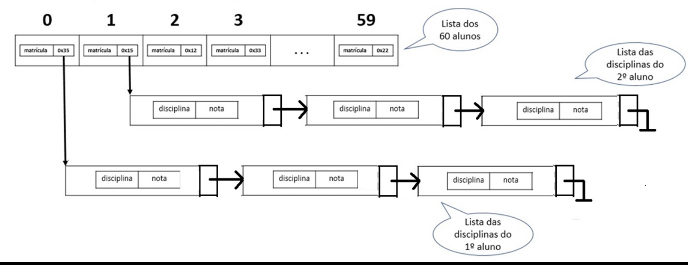

# 🖥️ Mini Projeto - SISFacul

### ⚙️ Problema a ser solucionado

Considere uma sala de 60 alunos (tamanho conhecido). Cada aluno
identificado pelo seu RGM possui sua lista de disciplinas (tamanho
variável para cada aluno). Desenvolver uma aplicação que:

- realize o cadastro EM ORDEM DO RGM de n alunos e, para cada aluno, m disciplinas (controlar com pergunta “Mais disciplina?”);
- mostre todos alunos, e respectivas disciplinas, cadastrados;
- procure um aluno pelo RGM e mostre seus dados, caso exista, ou mensagem de “não existe”;
- remova um aluno localizado pelo RGM;
- mostre a lista resultante após a remoção do aluno

### 📃 Ilustração Exemplar

### ☑️ Regas da Solução

- Obrigatório utilizar lista SEQUENCIAL (alunos) e ENCADEADA
  (disciplinas);
- Seguir a arquitetura conceitual da figura fornecida;
- Implementar em C ou Java (não usar classes ArrayList e LinkedList do
  java)
- Aplicação tipo console (sem interface gráfica), oferecendo um menu
  de opções (incluir, buscar, mostrar, remover);
- Atenção para a inserção ORDENADA de alunos pelo RGM;
- Alocação da lista sequencial é estática e a encadeada é dinâmica;

### 👥 Equipe

- <a href="https://github.com/NattanSilva" target="blank">
    
     
    Nattan Silva
  </a>

- <a href="https://github.com/Dereck234" target="blank">
    
      
    Dereck Patrick
  </a>

- <a href="https://github.com/EduardoCoura" target="blank">
    
      
    Eduardo Coura
  </a>
